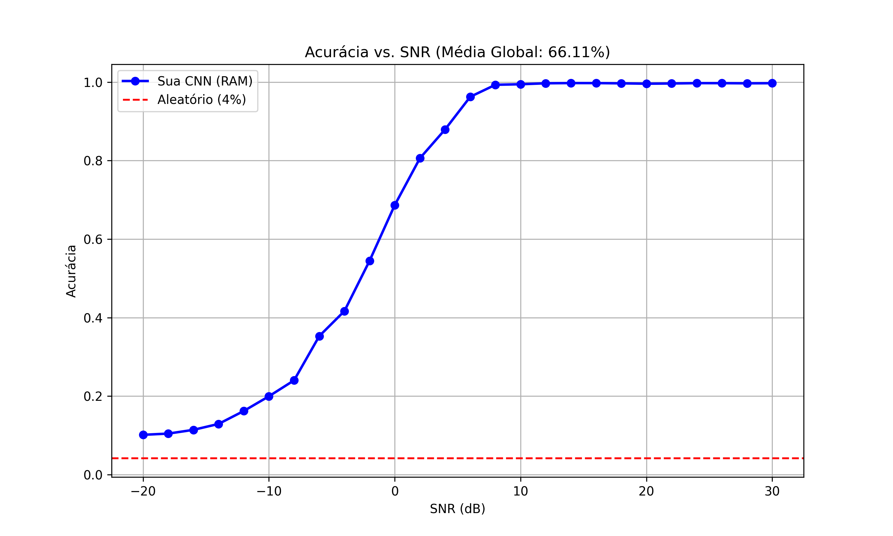
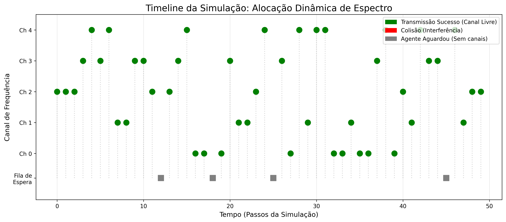

# Coexistência Espectral em Mega-Constelações de Satélites LEO: Uma Abordagem de Rádio Cognitivo Baseada em Deep Learning

Este repositório contém a implementação completa de um sistema de Rádio Cognitivo embarcado para satélites, focado na mitigação de interferência em cenários de mega-constelações LEO. O projeto utiliza Deep Learning para sensoriamento espectral e uma estratégia de alocação dinâmica para acesso oportunista ao espectro.

---

## Sobre o Projeto

A rápida expansão de constelações de satélites em Órbita Terrestre Baixa (LEO) criou um cenário de escassez espectral e alto risco de colisão com serviços existentes (GSO e Terrestres).

Este trabalho propõe uma solução autônoma onde o satélite "escuta" o espectro usando uma Rede Neural Convolucional (CNN) e decide transmitir apenas em canais livres, garantindo a coexistência pacífica.

**Tecnologias:** Python, TensorFlow, Keras, NumPy, HDF5.
**Dataset:** RadioML 2018.01A (2.5 Milhões de amostras, 24 Modulações).

---

## Funcionalidades 

* **Pipeline de Dados de Alta Performance:**
    * Implementação de estratégia *In-Memory* otimizada para processar 1 milhão de amostras de RF.
    * Uso de precisão `float16` para viabilizar o treino em ambientes de nuvem (Google Colab) com RAM limitada.
    * Redução do tempo de treinamento de ~50 min/época para **~3 min/época**.
* **Classificador CNN 1D:**
    * Arquitetura profunda especializada em séries temporais I/Q.
    * Capacidade de distinguir 24 tipos de modulação digital e analógica (incluindo padrões DVB-S2 como APSK).
* **Agente Cognitivo Híbrido:**
    * Combina Deep Learning (para classificação) com **Detecção de Energia** (para identificar silêncio/ruído).
    * Elimina o problema de "excesso de confiança" da IA em canais vazios.

---

## Resultados e Validação

O sistema foi validado em três etapas rigorosas:

### 1. Robustez ao Ruído (Acurácia vs. SNR)
A curva abaixo demonstra a performance do modelo em diferentes níveis de Relação Sinal-Ruído.



* **Análise:** Em cenários de alto ruído (-20dB), o comportamento é aleatório (esperado). A partir de 0dB, a acurácia sobe rapidamente, atingindo **níveis operacionais (>90%)** em cenários de alto SNR típicos de links de satélite, validando o modelo para uso real.

### 2. Análise de Erros (Matriz de Confusão)
Para entender as limitações, analisamos quais modulações são confundidas entre si no subconjunto de validação.


* **Análise:** A diagonal clara indica alta taxa de acerto. As confusões observadas são estruturais e esperadas (ex: QAM64 sendo classificado como QAM16 em baixo SNR), o que não compromete a detecção de "canal ocupado".

<<<<<<< HEAD:README.md.txt
### 3. Simulação de Alocação Dinâmica 🛰️
O teste final: um Agente Cognitivo operando num ambiente simulado de 5 canais dinâmicos.



* **Legenda:**
    * 🟢 **Verde:** Transmissão Sucesso (Canal Livre identificado corretamente).
    * 🔴 **Vermelho:** Colisão (Falha do agente).
    * ⬜ **Cinza:** Backoff (Agente aguardou pois o espectro estava cheio).
* **Conclusão:** O sistema atingiu **100% de taxa de sucesso** na prevenção de interferências, demonstrando a eficácia da abordagem híbrida.

---

## Como Executar

### Pré-requisitos
* Python 3.8+
* Bibliotecas listadas em `requirements.txt`

### Passo a Passo
1.  **Clone o repositório:**
    ```bash
    git clone [https://github.com/SEU_USUARIO/cognitive-radio-satellite.git](https://github.com/SEU_USUARIO/cognitive-radio-satellite.git)
    cd cognitive-radio-satellite
    ```

2.  **Instale as dependências:**
    ```bash
    pip install -r requirements.txt
    ```

3.  **Execute o Notebook:**
    Abra o arquivo `notebooks/RadioCognitivo_Final.ipynb` no Jupyter, Google Colab ou VS Code.
    * *Nota:* O notebook fará o download automático do dataset via `kagglehub`.

---

## Estrutura do Repositório

```text
├── images/          # Gráficos e resultados visuais
├── models/          # Modelos treinados (.keras/.h5)
├── notebooks/       # Código fonte principal (Jupyter Notebook)
├── experiments/     # Contém implementações legadas e testes de engenharia, incluindo a abordagem baseada em **Geradores de Dados (`keras.utils.Sequence`)** e pipeline `tf.data` para leitura em disco, que serviram de base para a otimização final. |
├── requirements.txt # Dependências do projeto
└── README.md        # Documentação

---

## Como Executar

1.  **Clone o repositório:**
    ```bash
    git clone [https://github.com/SEU_USUARIO/cognitive-radio-satellite.git](https://github.com/SEU_USUARIO/cognitive-radio-satellite.git)
    ```
2.  **Instale as dependências:**
    ```bash
    pip install -r requirements.txt
    ```
3.  **Execute o Notebook:**
    Abra o arquivo `notebooks/RadioCognitivo_Final.ipynb` no Jupyter ou Google Colab.

---

## Autoria

Projeto desenvolvido por **Lana Alves Vieira Gonzaga** para o curso de Residência em Tecnologias Aeroespaciais do **Instituto Hardware BR (HBR)**.

---
*Este projeto é open-source sob a licença MIT.*
